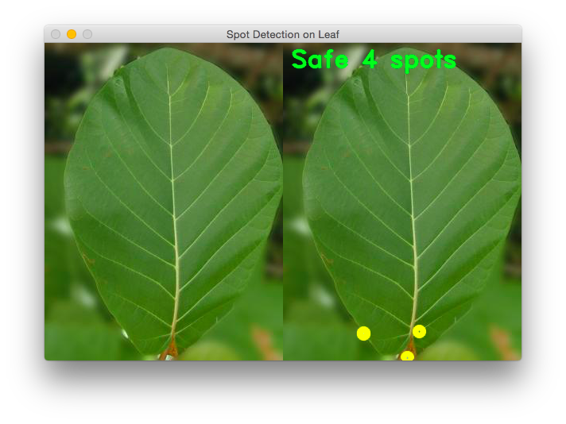
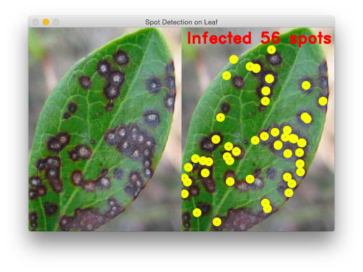

# OpenCV Spot Detection on Leaf
This program detects spots on leaf and counts them

## Screenshot ##

## HowTo ##

* Download OpenCV using `brew` [ `brew install opencv` ]
* Go to `Build Settings` and configure the following items

    * Set `Header Search Path` to `/usr/local/Cellar/opencv/2.4.11_1/include`
    * Set `Library Search Path` to `/usr/local/Cellar/opencv/2.4.11_1/lib`
    * Set `Linkers` `-lopencv_core -lopencv_highgui -lopencv_imgproc -lopencv_objdetect -lopencv_photo -lopencv_video`

* Hit `CMD+R`
